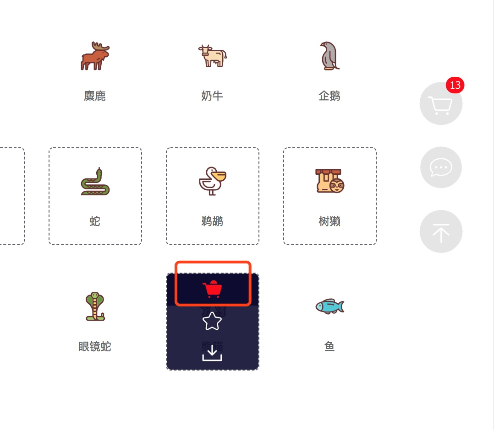
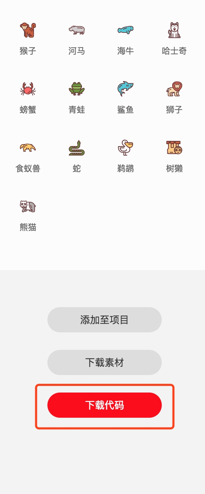
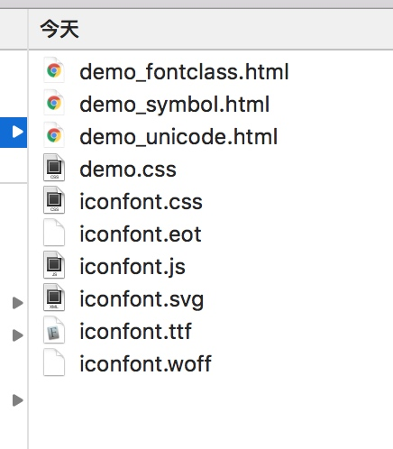
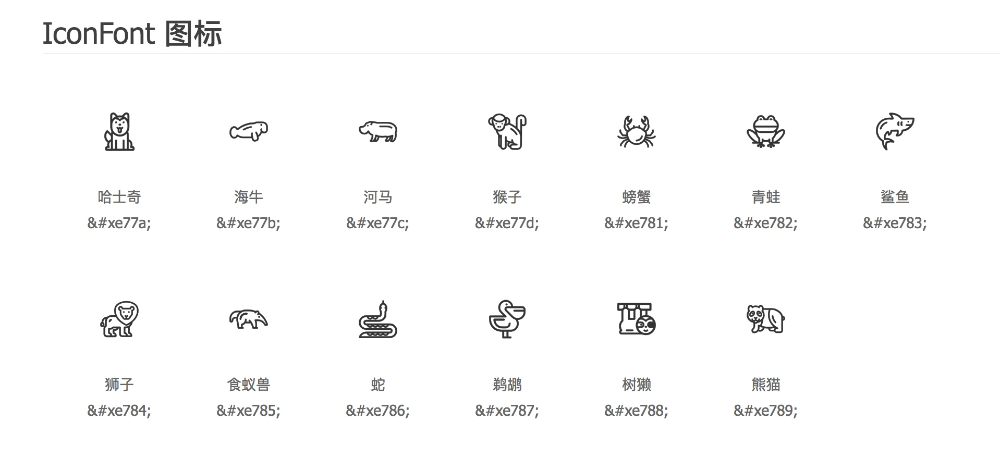
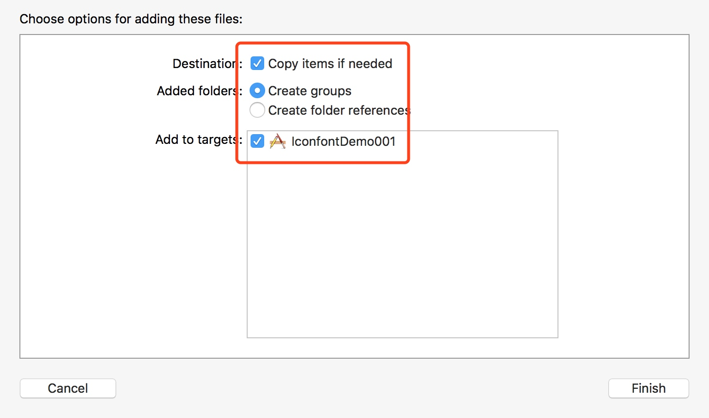
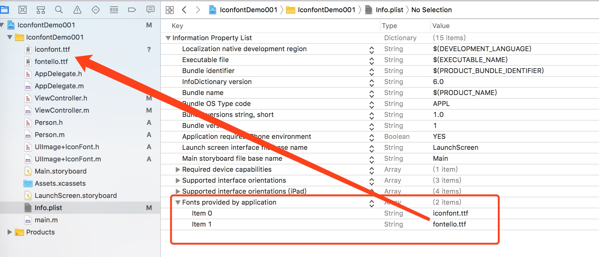
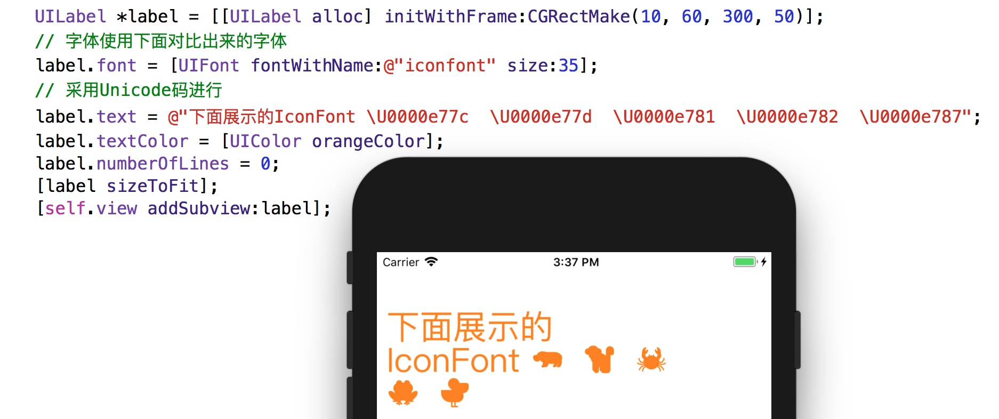
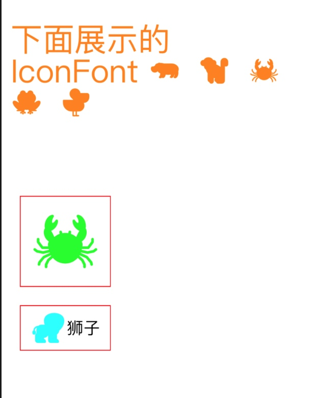

# IconFont的使用 #

**IconFont是啥？**

我们通常看到的图标都是以图片形式集成到项目中使用，而 Iconfont 是一套字体图标，和我们使用自定义字体的方式是一样的，并且它是一种矢量图标。
计算机中显示的图形一般分为两类---位图和矢量图，我们平常使用的JPEG、PNG等图片都是位图格式，是一种由像素来表示的图像，而矢量图是由点、直线、多边形等基于数学方程的几何图元表示的图像，对比位图，矢量图具有体积小，放大缩小都不会失真的优点，这个优点就可以给项目带来很大好处了，但缺点是无法用来表达色彩层次丰富的图像，因此一些色彩复杂的图形仍然需要位图去表达。我们项目在进行模块化碰到不同模块使用到相同的图片时，尤其是这种基础icon，复制多份到各自的模块中是不太优雅的，利用Iconfont就可以很好的解决。

**IconFont的优点**

* 图片进行复用，并且很方便的更改图片的大小和颜色。
* 减小应用体积，字体文件比图片要小；
* 图标保真缩放，解决2x/3x乃至将来nx图问题；
* 同一套资源可以应用在不同的平台 iOS，Android，web

**IconFont的缺点**
* 只是支持单色
* 制作成本高


**在iOS中的使用姿势**
对于制作IconFont的流程和其他平台的使用方式不做相关说明了，当前只说一下在iOS平台的使用说明

**1、IconFont的生成平台，生成资源包**
有很多的资源平台，当然了也可以自己制作
[阿里巴巴的平台](http://www.iconfont.cn/)








打开demo_unicode.html，我们可以看到Unicode码和图标之间的关系



**2、导入到项目中**


在Info.plist中进行配置，添加
`Fonts provided by application`选项，添加进来的`.ttf`文件名称添加到数组中


**3、在Label中使用**
使用方法和定制自定义的字体差不多。
首先要找到添加的.ttf对应的fontName的名称。

最笨的方法就是直接获取所有的字体，然后比较添加到plist之前和之后的字体有哪个不一样,可以将两次的打印结果放在Excel表格中进行对比。
```
NSArray*familyNames = [UIFont familyNames];
    
NSLog(@"familyNames.count === %ld",familyNames.count);
    
for(NSString*familyName in familyNames ){
        
	printf("Family: %s \n", [familyName UTF8String]);
        
}
```
在Label中直接使用

```
UILabel *label = [[UILabel alloc] initWithFrame:CGRectMake(10, 60, 300, 50)];
    // 字体使用下面对比出来的字体
    label.font = [UIFont fontWithName:@"iconfont" size:35];
    // 采用Unicode码进行
    label.text = @"下面展示的IconFont \U0000e77c  \U0000e77d  \U0000e781  \U0000e782  \U0000e787";
    label.textColor = [UIColor orangeColor];
    label.numberOfLines = 0;
    [label sizeToFit];
    [self.view addSubview:label];
```


颜色，大小可以随便设置

**4、在UIImage中使用**
将文字转化成图片就可以了
相关代码，封装成了一个分类
```
#import <UIKit/UIKit.h>

@interface UIImage (IconFont)


/**
 通过IconFont的形式创建图片
 * 例如 [UIImage imageWithIconFontName:@"iconfont" fontSize:100 text:@"\U0000e603" color:[UIColor greenColor]]

 @param iconFontName iconFont的name
 @param fontSize 字体的大小
 @param text 文本信息<unicode>
 @param color 颜色
 @return 创建的图片
 */
+ (UIImage *)imageWithIconFontName:(NSString *)iconFontName fontSize:(CGFloat)fontSize text:(NSString *)text color:(UIColor *)color;

@end

```

```
#import "UIImage+IconFont.h"
#import <CoreText/CoreText.h>

@implementation UIImage (IconFont)

/**
 通过IconFont的形式创建图片
 
 @param iconFontName iconFont的name
 @param fontSize 字体的大小
 @param text 文案
 @param color 颜色
 @return 创建的图片
 */
+ (UIImage *)imageWithIconFontName:(NSString *)iconFontName fontSize:(CGFloat)fontSize text:(NSString *)text color:(UIColor *)color
{
    
    CGFloat size = fontSize;
    CGFloat scale = [UIScreen mainScreen].scale;
    CGFloat realSize = size * scale;
    UIFont *font = [self fontWithSize:realSize withFontName:iconFontName];
    UIGraphicsBeginImageContext(CGSizeMake(realSize, realSize));
    CGContextRef context = UIGraphicsGetCurrentContext();
    
    if ([text respondsToSelector:@selector(drawAtPoint:withAttributes:)]) {
        /**
         * 如果这里抛出异常，请打开断点列表，右击All Exceptions -> Edit Breakpoint -> All修改为Objective-C
         * See: http://stackoverflow.com/questions/1163981/how-to-add-a-breakpoint-to-objc-exception-throw/14767076#14767076
         */
        [text drawAtPoint:CGPointZero withAttributes:@{NSFontAttributeName:font, NSForegroundColorAttributeName:color}];
    } else {
        
#pragma clang diagnostic push
#pragma clang diagnostic ignored "-Wdeprecated-declarations"
        CGContextSetFillColorWithColor(context, color.CGColor);
        [text drawAtPoint:CGPointMake(0, 0) withFont:font];
#pragma clang pop
    }
    
    UIImage *image = [UIImage imageWithCGImage:UIGraphicsGetImageFromCurrentImageContext().CGImage scale:scale orientation:UIImageOrientationUp];
    UIGraphicsEndImageContext();
    
    return image;
}


/**
 iconFont 转化font

 @param size 字体大小
 @param fontName 字体的名称
 @return 字体的font
 */
+ (UIFont *)fontWithSize:(CGFloat)size withFontName:(NSString *)fontName {
    
    UIFont *font = [UIFont fontWithName:fontName size:size];
    if (font == nil) {
        
        NSURL *fontFileUrl = [[NSBundle mainBundle] URLForResource:fontName withExtension:@"ttf"];
        [self registerFontWithURL: fontFileUrl];
        font = [UIFont fontWithName:fontName size:size];
        NSAssert(font, @"UIFont object should not be nil, check if the font file is added to the application bundle and you're using the correct font name.");
    }
    return font;
}

// 如果没有在info.plist中声明，在这注册一下也可以。
+ (void)registerFontWithURL:(NSURL *)url {
    NSAssert([[NSFileManager defaultManager] fileExistsAtPath:[url path]], @"Font file doesn't exist");
    CGDataProviderRef fontDataProvider = CGDataProviderCreateWithURL((__bridge CFURLRef)url);
    CGFontRef newFont = CGFontCreateWithDataProvider(fontDataProvider);
    CGDataProviderRelease(fontDataProvider);
    CTFontManagerRegisterGraphicsFont(newFont, nil);
    CGFontRelease(newFont);
}

@end
```

使用方法
```
UIImageView *imageView1 = [[UIImageView alloc] initWithFrame:CGRectMake(20, 350, 100, 100)];
    imageView1.image = [UIImage imageWithIconFontName:@"iconfont" fontSize:80 text:@"\U0000e781" color:[UIColor greenColor]];
    imageView1.layer.borderColor = [UIColor redColor].CGColor;
    imageView1.layer.borderWidth = 1;
    imageView1.contentMode = UIViewContentModeCenter;
    [self.view addSubview:imageView1];
    
    UIButton *btn = [UIButton buttonWithType:UIButtonTypeCustom];
    btn.frame = CGRectMake(20, CGRectGetMaxY(imageView1.frame)+20, 100, 50);
    [btn setTitle:@"狮子" forState:UIControlStateNormal];
    [btn setTitleColor:[UIColor blackColor] forState:UIControlStateNormal];
    btn.layer.borderWidth = 1;
    btn.layer.borderColor = [UIColor redColor].CGColor;
    [self.view addSubview:btn];
    
    UIImage *normalImage = [UIImage imageWithIconFontName:@"iconfont" fontSize:40 text:@"\U0000E784" color:[UIColor cyanColor]];
    [btn setImage:normalImage forState:UIControlStateNormal];
```




